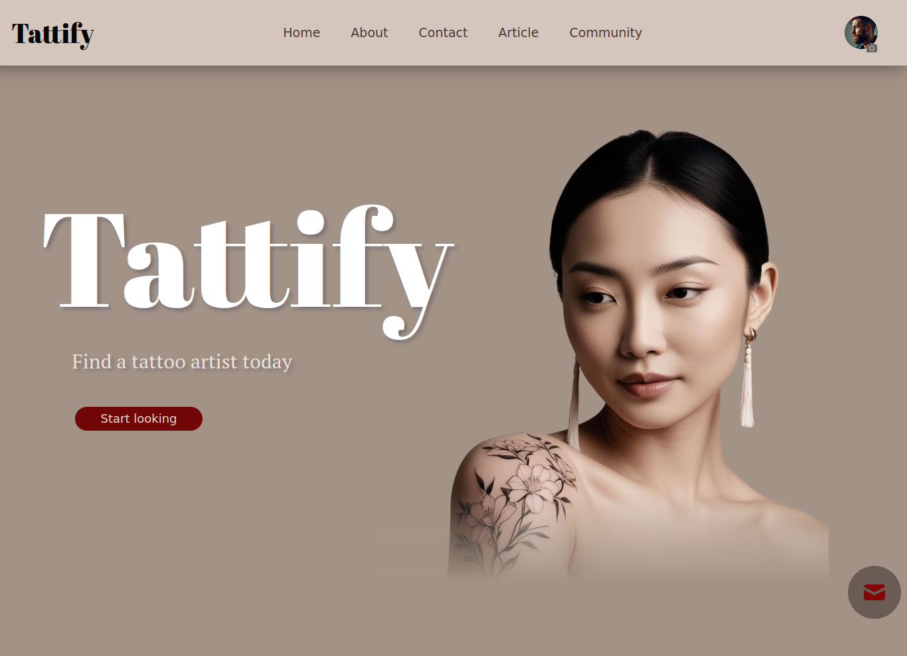
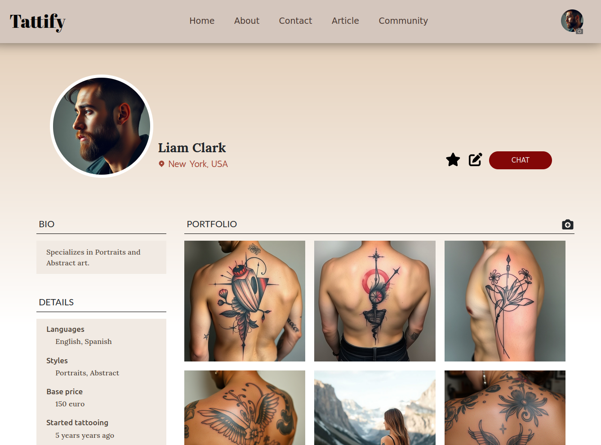
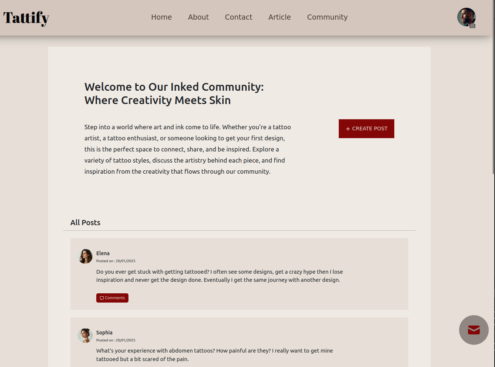
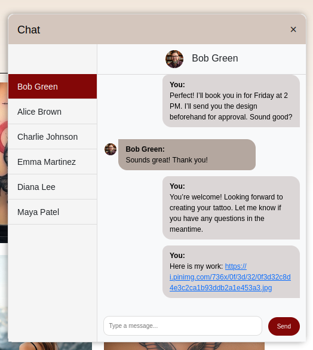
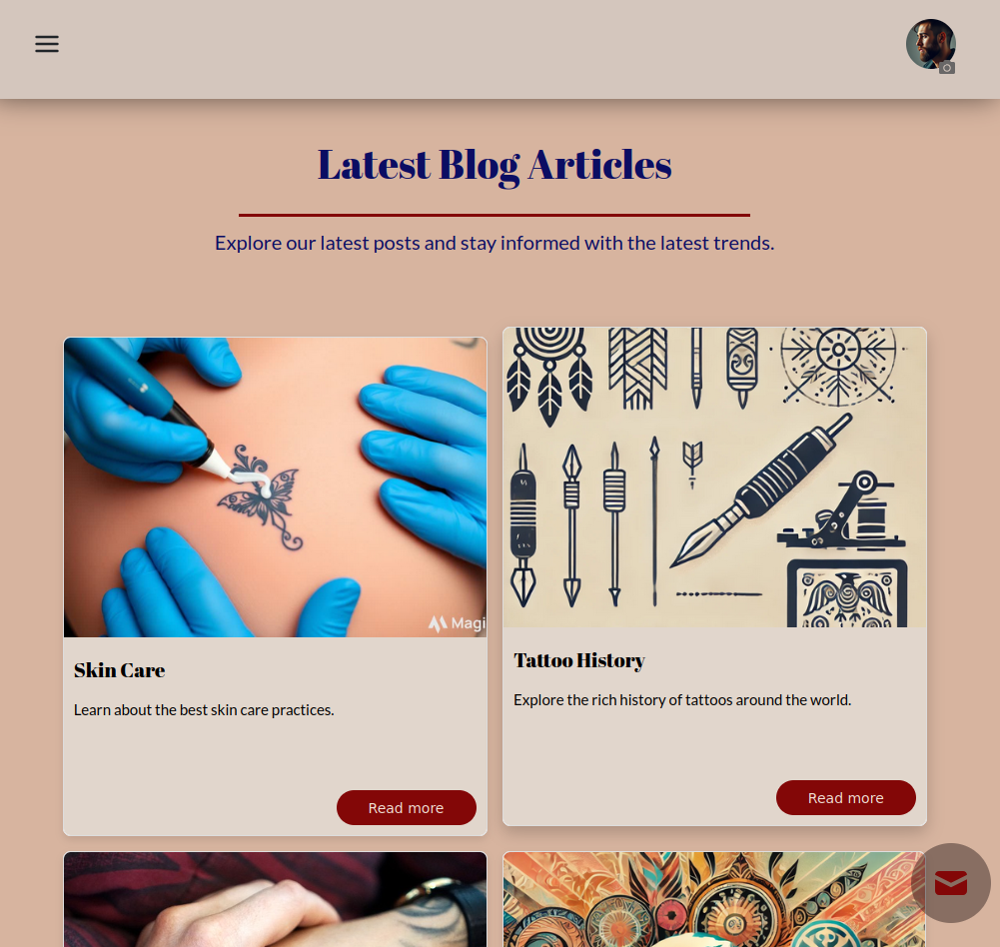
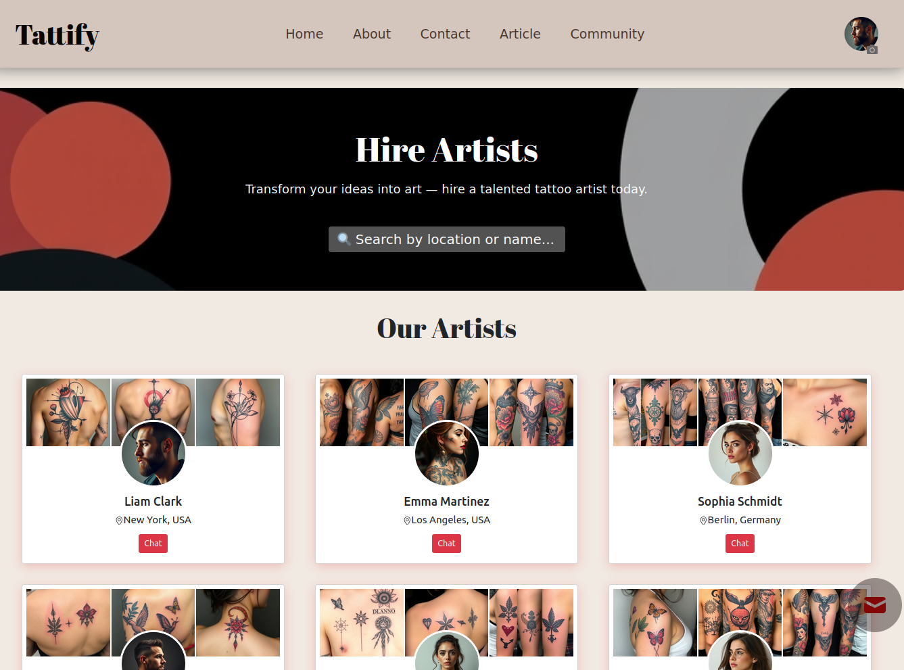

# Tattify

Tattify is a dynamic platform designed to bridge the gap between tattoo artists and customers. It serves as both a business hub for artists to showcase their work and a convenient tool for customers to find and book appointments with their ideal artists.

  
Table of Contents

  <ol>
    <li><a href="#about-the-project">Features</a></li>
    <li><a href="#screenshot">Screenshot</a></li>
    <li><a href="#live">Live Demo</a></li>
    <li><a href="#technology">Technologies Used</a></li> 
    <li><a href="#usage">Usage</a></li>
    <li><a href="#planned-features">Planned Features</a></li>
    <li><a href="#contributors">Contributors</a></li>
  </ol>

## Features

#### For Customers

- **Discover Artists:** Browse through artist profiles, view portfolios, and find the perfect artist for your style.

- **Search Functionality:** Search for artists by name or location to find someone near you.
- **Direct Messaging:** Start conversations with artists to discuss designs, availability, and pricing.
- **Community Page:** Engage with the tattoo community by participating in
  discussions, sharing designs, and getting inspiration from others.

#### For Artists

- **Profile Creation:** Showcase your portfolio, highlight your style, and attract clients.
- **Client Management:** Communicate with customers directly to confirm details and appointments.
- **Grow Your Business:** Gain visibility and connect with clients looking for talented artists.

## Screenshots

  
  

   
  
    
  

(<a href="#tattify-top">back to top</a>)

## Live Demo

Check out the live version of Tattify here: [Tattify Live](https://tattify-1.onrender.com/)

## Technologies Used

- [React](https://reactjs.org/) For building the user interface.
- [HTML](https://developer.mozilla.org/en-US/docs/Web/HTML) and [CSS](https://developer.mozilla.org/en-US/docs/Web/CSS): For structuring and styling the app.
- [Bootstrap](https://getbootstrap.com/): For responsive design and pre-built UI components.
- [Swiper.js](https://swiperjs.com/): For creating sleek, touch-enabled carousels and sliders.
- [JavaScript](https://developer.mozilla.org/en-US/docs/Web/JavaScript): For interactivity and logic.
- [Node.js](https://nodejs.org/): Backend runtime environment.
- [Express.js](https://expressjs.com/): For building server-side APIs.
- [MongoDB](https://www.mongodb.com/): NoSQL database for storing user data, profiles, and messages.
- [JWT](https://jwt.io/): For secure authentication using JSON Web Tokens.
- [Cookies](https://developer.mozilla.org/en-US/docs/Web/HTTP/Cookies): For session management and user data persistence.
- [Context API](): For managing global state.
- [Socket.IO](https://socket.io/): For real-time messaging and communication.

(<a href="#tattify-top">back to top</a>)

## Usage

1. For Customers:

   - Sign up and create a profile.
   - Browse artists or use the search feature to find someone specific.
   - Participate in the community discussions or explore articles.
   - Start a chat to discuss details and book appointments.
   - Rate and leave reviews for artists based on your experience.

2. For Artists:

   - Sign up as an artist, create a profile, and upload your portfolio.
   - Engage with the community.
   - Respond to client inquiries and manage bookings directly.
   - Receive ratings and reviews from clients.

## Planned Features

- **Appointment Booking:**
  Customers will be able to book appointments directly on the platform. The system will allow customers to select available time slots, ensuring a smooth booking process for both clients and artists.

- **Payment Integration:**
  A payment gateway (e.g., Stripe or PayPal) will be integrated for secure payments. Customers can pay for their tattoos in advance or after the service, and artists will receive their earnings efficiently.

- **In-App Notifications:**
  Real-time notifications for appointment confirmations, cancellations, or updates will be sent to both customers and artists.

## Contributors

If you have any questions or suggestions, feel free to reach out!

- **Aiza**

  - [GitHub](https://github.com/AizStein)
  - [LinkedIn](https://www.linkedin.com/in/aiza-s-400319313)

- **Urooj**

  - [GitHub](https://github.com/UroojSharif)

- **Dominik**

  - [GitHub](https://github.com/Domszilu)

- **Viktoriya**
  - [GitHub](https://github.com/Viktoriya2024)

(<a href="#tattify-top">back to top</a>)

